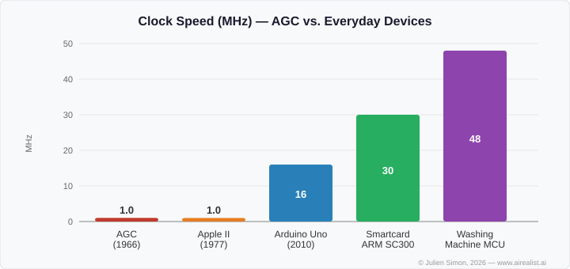
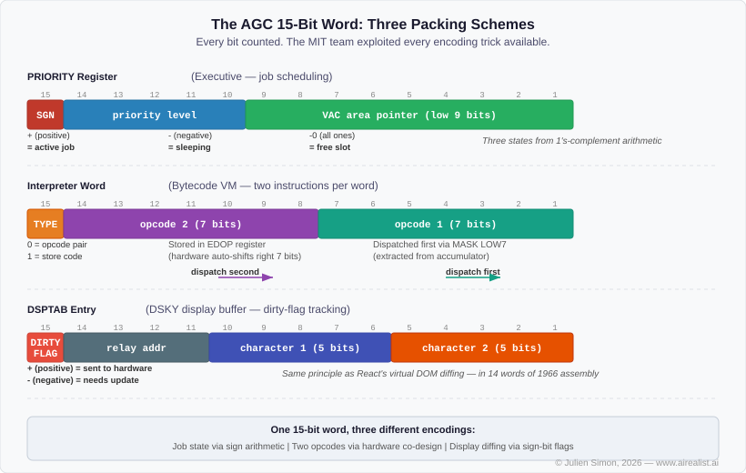
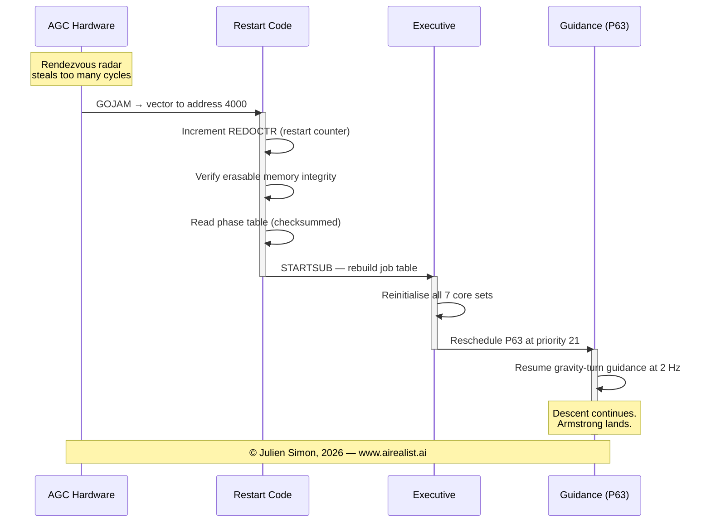
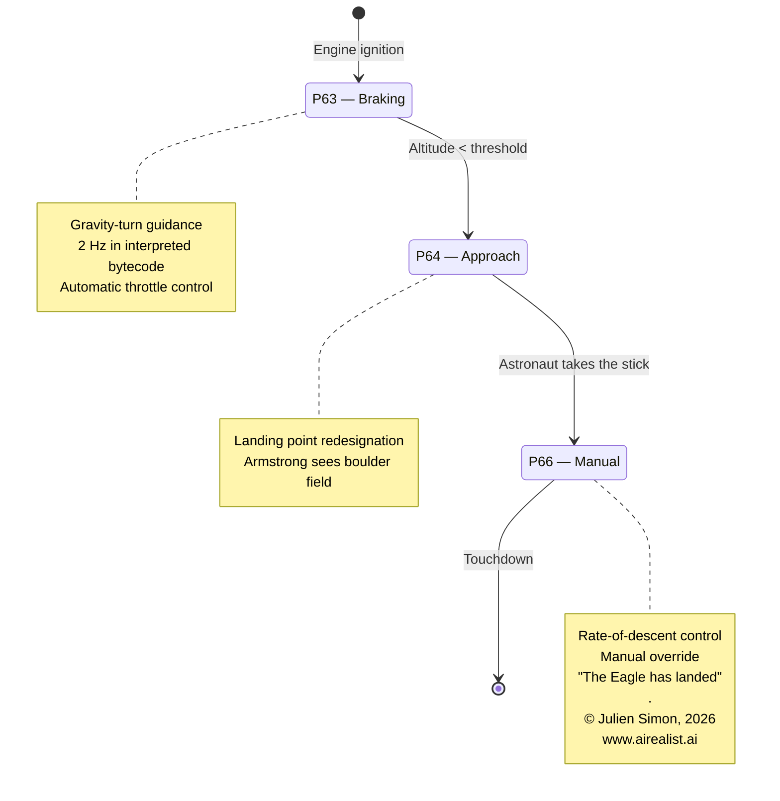

# I Used AI to Walk Through the Code That Landed Humans on the Moon

The Apollo 11 Guidance Computer source code has been on GitHub since 2016. 40,000 lines of 1960s assembly code for a 15-bit computer with 4 KB of RAM. The code that flew Neil Armstrong to the Moon, handled the 1202 alarms during descent, and brought the crew home. Public domain. Free to read.

Almost nobody can read it.

## Why I Wrote This

Two things collided in my head.

First, **[Artemis II](https://www.nasa.gov/mission/artemis-ii/) is about to fly** — the first crewed mission beyond low Earth orbit since 1972. Humans are going back to the Moon. It felt like the right moment to look at the software that got us there the first time, before the next chapter starts.

Second, I keep hearing the same objection from engineering teams when I talk about AI agents: **"Our codebase is too legacy for AI."** Too old. Too weird. Too far from the Python and TypeScript that LLMs were trained on. Hold my beer. If an AI can make sense of 1960s assembly for a 15-bit computer with 1's-complement arithmetic and bank-switched memory, your decade-old Java monolith is not the hard case you think it is.

## The Machine

Some numbers to calibrate your intuition. The [Apollo Guidance Computer](https://en.wikipedia.org/wiki/Apollo_Guidance_Computer) had a 1.024 MHz clock (from a 2.048 MHz oscillator, divided by two). A typical instruction took two memory cycles of 11.72 microseconds each — about 23 microseconds per instruction, or roughly 43,000 instructions per second. It addressed 36,864 words of fixed (ROM) memory and 2,048 words of erasable (RAM) memory. Each word was 15 bits plus a parity bit. Total memory: about 72 KB in modern byte-equivalent terms — but only ~4 KB of that was RAM — [magnetic core memory](https://en.wikipedia.org/wiki/Magnetic-core_memory), tiny ferrite rings whose magnetization direction stored one bit each. The rest was read-only. The AGC cost roughly $200,000 per unit in 1966 dollars — about $1.9 million today.

Four kilobytes of working memory. To put that in perspective: a typical smartcard chip (the one in your bank card) runs an ARM SC300 at 30+ MHz with 300 KB of ROM — faster clock, more memory, fits on your fingernail. An Arduino Uno (16 MHz, 32 KB flash, 2 KB SRAM, $25) is remarkably close to the AGC's spec sheet, fifty years later. The Apple II (1977, 1 MHz 6502, 48 KB RAM) had a comparable clock speed and more RAM for $1,298 — eight years after Apollo 11. A modern washing machine controller runs a Cortex-M0 at 48 MHz with up to 256 KB of flash — roughly 50x the AGC's clock speed.



The AGC, however, was purpose-built for one job: real-time guidance and navigation in space. Its ROM was [core rope memory](https://en.wikipedia.org/wiki/Core_rope_memory) — literally woven by hand by factory workers, threading wires through or around tiny magnetic cores to encode ones and zeros. A single bit was a physical knot. The entire program was frozen into hardware months before launch and could not be patched in flight. The AGC also had a hardware restart capability (`GOJAM`), hardwired I/O channels to the inertial measurement unit, the radar, the engine, and the DSKY display. No general-purpose computer of the era could do what it did because none were designed to survive the failure modes of spaceflight.

The software was written by a team of about 350 people at the MIT Instrumentation Laboratory, led by [Margaret Hamilton](https://en.wikipedia.org/wiki/Margaret_Hamilton_%28software_engineer%29). Many of the flight software developers were in their mid-twenties. Hamilton coined the term **"software engineering"** — a phrase considered an oxymoron at the time. Her team's insistence that software be engineered with the same rigour as hardware is what saved the Apollo 11 landing when things went wrong.

## The Problem

AGC4 assembly is a dead language. The architecture is 1's-complement (not 2's-complement like every modern CPU). The primary conditional branch, `CCS`, does a 4-way skip based on positive, plus-zero, negative, and minus-zero — because 1's-complement has two representations of zero. There's no stack. One register holds one return address. Memory is bank-switched through three different registers plus a "superbank" bit. The codebase is split between native assembly and an interpreted bytecode language that runs on a software virtual machine built into the AGC itself.

Every bit of every 15-bit word was exploited. The same word format encodes job scheduling state, packed bytecode opcodes, and display buffer dirty flags — three completely different packing schemes depending on the module:


Existing resources cover the history well. Simon Allardice did a Pluralsight course for the 50th anniversary. The Virtual AGC project at ibiblio.org provides emulators and an excellent assembly language manual. Borja Sotomayor wrote a good Medium explainer on the `FLAGORGY` subroutine. But nobody had done a systematic, module-by-module technical walkthrough of the actual code — the kind where you trace register contents through an instruction sequence and explain what each line does and why.

I wanted to know if AI could do that. Not as a stunt, but as a genuine test: can an LLM trained overwhelmingly on modern code make sense of a dead architecture for which it has almost no training data?

## The Method

The critical insight came early: you cannot just point Claude at AGC assembly and ask it to explain. Without an architectural context, the model assumes modern conventions. It treats `CCS` as a simple conditional. It misses the `TS` skip-on-overflow pattern. It doesn't understand bank switching.

So I built a [3,500-word context prompt](https://github.com/juliensimon/apollo11-ai-walkthrough/blob/master/prompts/phase1-context.md) — a condensed AGC4 architecture reference covering the instruction set, memory map, register file, interrupt system, and the interpreter's packed opcode format. I also fetched and cached the actual Virtual AGC Assembly Language Manual from ibiblio.org and injected key sections alongside my summary as ground truth. Belt and suspenders: the summary provides the model with a reasoning framework; the raw manual prevents hallucination about specifics.

The workflow was five phases, all scripted (all [prompts](https://github.com/juliensimon/apollo11-ai-walkthrough/tree/master/prompts) are in the repo):

1. **Context priming** — the architecture reference, loaded into every API call
2. **Repo reconnaissance** — scan all 175 `.agc` files, extract headers, categorize by function
3. **Targeted deep dives** — one per key module, each receiving the full source file plus the architecture context
4. **Synthesis** — feed all walkthrough files back in, extract cross-cutting lessons
5. **Quality check** — cross-reference claims across files, verify against the manual, flag inconsistencies

I used Claude Code's CLI in pipe mode (`claude -p`) with Opus 4.6. Each deep dive took 3-7 minutes of compute. Total wall-clock time for the entire project: under an hour of model time across two days. No API key needed — my Max subscription covered it.

## What the Code Reveals

Eight walkthrough files. 6,500 lines of analysis. Here's what each module taught us.

**[The Executive](https://github.com/juliensimon/apollo11-ai-walkthrough/blob/master/walkthrough/01-executive.md)** — The AGC had no operating system; the Executive *was* the operating system. It implements cooperative multitasking across 7 fixed-core sets with priority-based scheduling in ~600 lines of assembly. The design anticipates Go's goroutine scheduler and Python's asyncio by decades. With fixed resource pools and static analysis, the MIT team could prove their scheduler would never run out of slots, something no modern system with 10,000 goroutines can claim.

**[The Waitlist](https://github.com/juliensimon/apollo11-ai-walkthrough/blob/master/walkthrough/02-waitlist.md)** — The timer-driven task scheduler that ran the AGC's real-time heartbeat. It fires tasks at precise intervals using the hardware TIME3 counter, managing up to 9 concurrent timed events. The source comments include a hand-computed worst-case execution time analysis, written in 1966, before real-time systems theory existed as a formal discipline.

**[Fresh Start & Restart](https://github.com/juliensimon/apollo11-ai-walkthrough/blob/master/walkthrough/03-restart.md)** — The module that saved Apollo 11. When the 1202 alarms fired during descent, this code restarted the computer, verified the integrity of a checksummed phase table, reinitialised all scheduling, and resumed the guidance equations within milliseconds, while the descent engine kept firing. This is a crash-only design and "let it crash" philosophy, implemented 20 years before Erlang and 37 years before the pattern was formally described at Stanford.



**[Landing Guidance Equations](https://github.com/juliensimon/apollo11-ai-walkthrough/blob/master/walkthrough/04-landing-guidance.md)** — The math that flew the Lunar Module to the surface. Programs P63 (braking), P64 (approach with redesignation), and P66 (manual rate-of-descent) implement a gravity-turn guidance algorithm running at 2 Hz in interpreted bytecode. The code handles the transition from automatic to manual control, the moment Armstrong took the stick to dodge a boulder field.



**[BURN_BABY_BURN](https://github.com/juliensimon/apollo11-ai-walkthrough/blob/master/walkthrough/05-burn-baby-burn.md)** — The master ignition routine that starts every engine burn. It uses table-driven virtual method dispatch — structurally identical to a C++ vtable — so one generic routine handles descent, ascent, and orbital burns. Also, the most culturally rich file in the codebase: Latin inscriptions ("NOLI SE TANGERE" — touch it not), a reference to the Order of the Garter, and the word "EXTIRPATE" where a modern programmer would write "clear."

**[The Interpreter](https://github.com/juliensimon/apollo11-ai-walkthrough/blob/master/walkthrough/06-interpreter.md)** — The flight software wouldn't fit in 36K words of ROM as native assembly, so MIT built a bytecode virtual machine inside the AGC. It packs two 7-bit opcodes per 15-bit word, provides vector/matrix math and trig functions, and runs 10–25x slower than native code, but it saved an estimated 15,000–40,000 words of ROM. Without it, there is no Moon landing. This predates the Java JVM by nearly 30 years.

**[Pinball Game (DSKY Interface)](https://github.com/juliensimon/apollo11-ai-walkthrough/blob/master/walkthrough/07-dsky-interface.md)** — The astronaut's only interface to the AGC: 19 keys and 7-segment displays. The Verb-Noun command language is one of the earliest structured human-computer interfaces. The display buffer (`DSPTAB`) uses sign bits as dirty flags, the same principle as React's virtual DOM diffing, in 14 words of 1966 assembly. At ~3,800 lines, it's one of the largest modules in Luminary.

**[Lessons for 2026](https://github.com/juliensimon/apollo11-ai-walkthrough/blob/master/walkthrough/08-lessons.md)** — A synthesis essay covering architectural patterns ahead of their time, constraints as a design force, the 1202 story as a case study in graceful degradation, and what a 2026 engineer building safety-critical systems can still learn from code written for a 15-bit computer with 2K of RAM.

To give you a flavour of what this code looks like — here's how the master ignition routine announces itself, and how the error handler is named:

```agc
# BURN, BABY, BURN -- MASTER IGNITION ROUTINE

# THE MASTER IGNITION ROUTINE IS DESIGNED FOR USE BY THE
# FOLLOWING LEM PROGRAMS: P12, P40, P42, P61, P63.
```

```agc
		TC	POSTJUMP	# RESUME SENDS CONTROL HERE
		CADR	ENEMA
POODOO		INHINT
		CA	Q
ABORT2		TS	ALMCADR
```

Yes, the fatal error handler for the Moon landing software is called `POODOO`. The routine it jumps past is called `ENEMA`. These were real labels in real flight code, reviewed by NASA, and woven into core rope memory. The engineers were in their twenties, under existential pressure, and coped by naming things accordingly.

## Where the AI Struggled

Honest accounting matters more than the successes. I double-checked the model's output with additional runs.

The model showed ambiguity about the exact number of Executive core sets (7 vs 8—a CCS loop-counter interpretation question). Both readings are defensible depending on whether you count the running job's context as a "core set." I standardised the language across all files.

The I/O channel 14 description in the BURN_BABY_BURN walkthrough was oversimplified — described as "controls the DPS throttle" when channel 14 is actually a multi-function output channel where specific bits handle engine commands. Accurate in spirit, imprecise in detail. I corrected it.

The DSKY walkthrough called the Verb-Noun interface "the world's first" command-line interface. Probably true given the 1966 date, but unprovable. I softened it to "one of the earliest."

The pattern is consistent: the model is strong on control flow, data structures, and architectural reasoning. It struggles at the hardware boundary — where software behaviour depends on physical properties of specific registers, I/O channels, or timing. This is exactly what you'd expect from a model trained overwhelmingly on high-level code. The context prompt helps, but it can't fully substitute for hands-on experience with the actual hardware. Every claim at the hardware boundary needed manual verification.

None of these errors was catastrophic. The architectural understanding — instruction semantics, control flow, data structures — was consistently correct across 6,500 lines of output.

## The Takeaway

This project isn't about AI writing code. The AI didn't produce a single line of AGC assembly. It *reads* code and translates it into something modern developers can understand.

Most code is read far more than it is written. The most important code is old. The AGC is an extreme case, but the pattern applies everywhere: legacy COBOL in banking, vintage Fortran in scientific computing, decade-old C++ in embedded systems. If AI can make 1960s assembly for a dead architecture accessible, what else can it unlock? Legacy modernisation. Regulatory code review. Technical due diligence on acquisitions. Onboarding engineers onto unfamiliar codebases.

The Apollo 11 source code is nearly six decades old. It ran on a computer with less memory than this paragraph. And an AI trained on modern code — with the right architectural context — can read it, trace its control flow, identify its design patterns, and explain why it still matters.

The process I followed — context priming, structured reconnaissance, targeted deep dives, synthesis — isn't specific to the AGC. It's a playbook for any legacy codebase. If you're sitting on a million lines of COBOL, Fortran, or early C++ that nobody fully understands, this same approach can help you explore, document, and plan a migration path. Feed the AI the architecture context it needs, point it at the code module by module, and let it build the documentation that should have existed all along.

No code is too old for Claude. You just have to teach the architecture first.

---

*The complete walkthrough — 8 modules, 6,500 lines of technical analysis, all prompts used, and a full process trace documenting what the AI got right and wrong — is on GitHub: [apollo11-ai-walkthrough](https://github.com/juliensimon/apollo11-ai-walkthrough). Give it a star if you found this useful.*