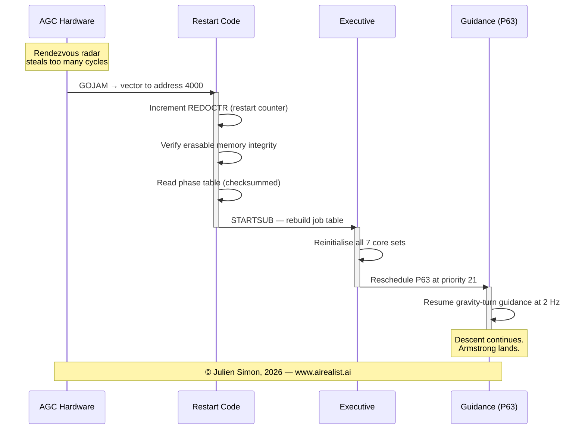
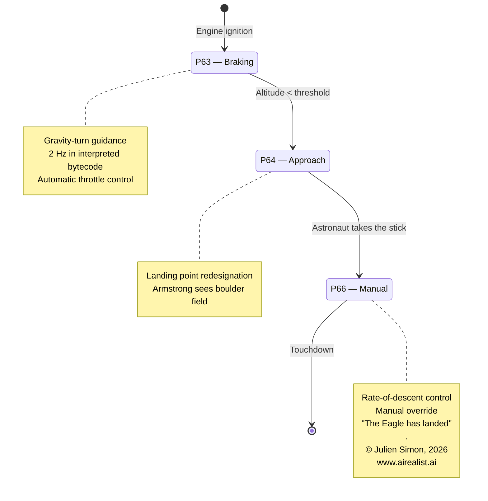

# 我用 AI 导读了让人类登上月球的代码

Apollo 11 制导计算机源代码自 2016 年起就挂在 GitHub 上。40,000 行 1960 年代的汇编代码，运行于一台 15 位计算机，拥有 4 KB 的 RAM。这段代码将 Neil Armstrong 送上了月球，在下降过程中处理了 1202 警报，并将机组人员安全带回地球。公共领域。免费阅读。

几乎没有人能读懂它。

## 我为什么写这篇文章

两件事在我脑海中碰撞。

首先，**[Artemis II](https://www.nasa.gov/mission/artemis-ii/) 即将飞行**——这是自 1972 年以来首次载人飞越近地轨道的任务。人类正在重返月球。在下一个篇章开启之前，回顾一下第一次送我们上去的软件，感觉正是时候。

其次，当我与工程团队谈论 AI 智能体时，我不断听到同样的反对意见：**"我们的代码库对 AI 来说太老旧了。"** 太古老。太奇特。距离 LLM 训练所用的 Python 和 TypeScript 太远了。且慢。如果 AI 能理解 1960 年代为 15 位计算机编写的、使用 1 的补码运算和分库内存寻址的汇编代码，那你那个十年前的 Java 单体应用就没你想象的那么难啃。

## 这台机器

先用一些数字来校准你的直觉。[阿波罗制导计算机](https://en.wikipedia.org/wiki/Apollo_Guidance_Computer)的时钟频率为 1.024 MHz（来自 2.048 MHz 振荡器，二分频）。一条典型指令需要两个内存周期，每个周期 11.72 微秒——每条指令约 23 微秒，即大约每秒 43,000 条指令。它寻址 36,864 字的固定（ROM）内存和 2,048 字的可擦除（RAM）内存。每个字为 15 位加一个奇偶校验位。以现代字节当量计算，总内存约为 72 KB——但其中只有约 4 KB 是 RAM——[磁芯存储器](https://en.wikipedia.org/wiki/Magnetic-core_memory)，微小的铁氧体环，其磁化方向存储一个比特。其余均为只读。1966 年，每台 AGC 的造价约为 200,000 美元——相当于今天的约 190 万美元。

四千字节的工作内存。作为参照：典型的智能卡芯片（你银行卡里的那个）以 30+ MHz 的频率运行 ARM SC300，拥有 300 KB ROM——频率更高，内存更多，放在你指甲上。Arduino Uno（16 MHz，32 KB 闪存，2 KB SRAM，25 美元）在规格参数上与 AGC 惊人地接近，五十年后。Apple II（1977 年，1 MHz 6502，48 KB RAM）有相近的时钟速度和更多 RAM，售价 1,298 美元——Apollo 11 之后八年。现代洗衣机控制器运行 48 MHz Cortex-M0，拥有多达 256 KB 的闪存——大约是 AGC 时钟速度的 50 倍。


然而，AGC 是为一项任务专门打造的：太空中的实时制导与导航。它的 ROM 是[绳芯存储器](https://en.wikipedia.org/wiki/Core_rope_memory)——由工厂工人手工编织而成，将导线穿过或绕过微小的磁芯来编码 0 和 1。每一个比特都是一个实物的绳结。整个程序在发射前数月就被固化进硬件，无法在飞行中打补丁。AGC 还具有硬件重启能力（`GOJAM`），以及到惯性测量单元、雷达、发动机和 DSKY 显示器的硬连线 I/O 通道。那个时代没有通用计算机能做到它所做的，因为没有任何计算机是为承受太空飞行的故障模式而设计的。

这款软件由麻省理工学院仪器实验室约 350 人的团队编写，由 [Margaret Hamilton](https://en.wikipedia.org/wiki/Margaret_Hamilton_%28software_engineer%29) 领导。许多飞行软件开发人员当时只有二十几岁。Hamilton 创造了**"软件工程"**这个词——这在当时被认为是一个自相矛盾的词。她团队坚持以与硬件同等的严格标准来工程化软件，这正是在事情出错时拯救了 Apollo 11 着陆的原因。

## 问题所在

AGC4 汇编是一门死语言。其架构是 1 的补码（而非每台现代 CPU 所用的 2 的补码）。主要条件分支指令 `CCS` 基于正数、正零、负数和负零做 4 路跳转——因为 1 的补码有两种零的表示形式。没有堆栈。一个寄存器只能保存一个返回地址。内存通过三个不同的寄存器加一个"超级库"位进行分库切换。代码库分为原生汇编和一种在 AGC 自身内置的软件虚拟机上运行的解释字节码语言。

每个 15 位字的每一位都被利用得淋漓尽致。同一种字格式根据模块的不同，编码作业调度状态、打包字节码操作码和显示缓冲区脏标记——三种截然不同的打包方案：


现有资料对其历史有很好的记载。Simon Allardice 在 50 周年纪念时做了一门 Pluralsight 课程。ibiblio.org 的 Virtual AGC 项目提供模拟器和优秀的汇编语言手册。Borja Sotomayor 在 Medium 上写了一篇关于 `FLAGORGY` 子程序的好文章。但从未有人对实际代码进行系统的、逐模块的技术导读——那种追踪寄存器内容、逐指令序列解释每行代码的作用及原因的导读。

我想知道 AI 能否做到这一点。不是作为噱头，而是作为一次真实的测试：一个主要在现代代码上训练的 LLM，能否理解一种几乎没有训练数据的死架构？

## 方法

关键洞见很早就出现了：你不能只是把 AGC 汇编代码扔给 Claude 然后让它解释。没有架构背景，模型会假设现代惯例。它会把 `CCS` 当作简单的条件分支。它会错过 `TS` 的溢出跳转模式。它不理解分库切换。

所以我构建了一个 [3,500 字的上下文提示词](https://github.com/juliensimon/apollo11-ai-walkthrough/blob/master/prompts/phase1-context.md)——一份精简的 AGC4 架构参考，涵盖指令集、内存映射、寄存器文件、中断系统和解释器的打包操作码格式。我还从 ibiblio.org 获取并缓存了实际的 Virtual AGC 汇编语言手册，并将关键章节与我的摘要一起作为基本事实注入。双重保险：摘要为模型提供推理框架；原始手册防止对细节产生幻觉。

工作流程分五个阶段，全部脚本化（所有[提示词](https://github.com/juliensimon/apollo11-ai-walkthrough/tree/master/prompts)都在仓库中）：

1. **上下文预热** — 架构参考，加载到每个 API 调用中
2. **仓库侦察** — 扫描全部 175 个 `.agc` 文件，提取头文件，按功能分类
3. **针对性深度解析** — 每个关键模块各一次，每次接收完整源文件加架构上下文
4. **综合** — 将所有导读文件回送，提取跨领域的经验教训
5. **质量检查** — 跨文件交叉引用声明，对照手册验证，标记不一致之处

我使用 Claude Code 的 CLI 管道模式（`claude -p`）搭配 Opus 4.6。每次深度解析耗时 3-7 分钟计算时间。整个项目的实际挂钟时间：跨两天不到一小时的模型时间。无需 API 密钥——我的 Max 订阅已涵盖。

## 代码揭示了什么

八个导读文件。6,500 行分析。以下是每个模块教给我们的内容。

**[执行程序](https://github.com/juliensimon/apollo11-ai-walkthrough/blob/master/walkthrough/01-executive.md)** — AGC 没有操作系统；执行程序*就是*操作系统。它在约 600 行汇编代码中，跨 7 个固定核心集实现了基于优先级调度的协作式多任务。这一设计比 Go 的 goroutine 调度器和 Python 的 asyncio 早了数十年。通过固定资源池和静态分析，MIT 团队可以证明他们的调度器永远不会耗尽槽位，这是任何拥有 10,000 个 goroutine 的现代系统都无法声称的。

**[等待列表](https://github.com/juliensimon/apollo11-ai-walkthrough/blob/master/walkthrough/02-waitlist.md)** — 驱动 AGC 实时心跳的定时器任务调度器。它使用硬件 TIME3 计数器以精确的时间间隔触发任务，管理多达 9 个并发定时事件。源代码注释中包含了手工计算的最坏情况执行时间分析，写于 1966 年，彼时实时系统理论作为一门正式学科尚未存在。

**[冷启动与重启](https://github.com/juliensimon/apollo11-ai-walkthrough/blob/master/walkthrough/03-restart.md)** — 拯救了 Apollo 11 的模块。当下降过程中 1202 警报触发时，这段代码重启了计算机，验证了带校验和的阶段表的完整性，重新初始化了所有调度，并在几毫秒内恢复了制导方程，而此时下降发动机仍在点火。这是只崩溃设计和"让它崩溃"哲学的实现，比 Erlang 早了 20 年，比这一模式在斯坦福被正式描述早了 37 年。



**[着陆制导方程](https://github.com/juliensimon/apollo11-ai-walkthrough/blob/master/walkthrough/04-landing-guidance.md)** — 将登月舱飞向月面的数学方法。程序 P63（制动）、P64（带重新指定的接近）和 P66（手动下降速率）实现了一种以 2 Hz 运行于解释字节码中的重力转向制导算法。代码处理了从自动控制到手动控制的切换——Armstrong 操控摇杆绕过陨石坑的那一刻。



**[BURN_BABY_BURN](https://github.com/juliensimon/apollo11-ai-walkthrough/blob/master/walkthrough/05-burn-baby-burn.md)** — 启动每次发动机点火的主点火程序。它使用表驱动的虚函数分派——结构上与 C++ 虚表完全相同——使一个通用程序能处理下降、上升和轨道点火。此外，这也是代码库中文化内涵最丰富的文件：拉丁文铭文（"NOLI SE TANGERE"——勿碰此处）、嘉德勋章的引用，以及在现代程序员写"clear"的地方使用了"EXTIRPATE"一词。

**[解释器](https://github.com/juliensimon/apollo11-ai-walkthrough/blob/master/walkthrough/06-interpreter.md)** — 飞行软件若以原生汇编形式编写，将无法装入 36K 字的 ROM，因此 MIT 在 AGC 内部构建了一个字节码虚拟机。它将两个 7 位操作码打包进一个 15 位字中，提供向量/矩阵运算和三角函数，运行速度比原生代码慢 10–25 倍，但它估计节省了 15,000–40,000 字的 ROM。没有它，就没有登月。这比 Java JVM 早了近 30 年。

**[弹球游戏（DSKY 接口）](https://github.com/juliensimon/apollo11-ai-walkthrough/blob/master/walkthrough/07-dsky-interface.md)** — 宇航员与 AGC 的唯一接口：19 个按键和七段数码管显示器。动词-名词命令语言是最早的结构化人机交互界面之一。显示缓冲区（`DSPTAB`）使用符号位作为脏标记，与 React 虚拟 DOM 差异比较的原理相同，用 1966 年的 14 个汇编字实现。该模块约有 3,800 行，是 Luminary 中最大的模块之一。

**[2026 年的启示](https://github.com/juliensimon/apollo11-ai-walkthrough/blob/master/walkthrough/08-lessons.md)** — 一篇综合论文，涵盖领先于时代的架构模式、约束作为设计驱动力、1202 事件作为优雅降级的案例研究，以及 2026 年构建安全关键系统的工程师仍可从为 15 位、2K RAM 计算机编写的代码中学到什么。

为了让你感受一下这段代码的样子——以下是主点火程序如何介绍自己，以及错误处理程序是如何命名的：

```agc
# BURN, BABY, BURN -- MASTER IGNITION ROUTINE

# THE MASTER IGNITION ROUTINE IS DESIGNED FOR USE BY THE
# FOLLOWING LEM PROGRAMS: P12, P40, P42, P61, P63.
```

```agc
TCPOSTJUMP# RESUME SENDS CONTROL HERE
CADRENEMA
POODOOINHINT
CAQ
ABORT2TSALMCADR
```

是的，月球着陆软件的致命错误处理程序叫做 `POODOO`。它跳过的程序叫 `ENEMA`。这些都是真实飞行代码中的真实标签，经过 NASA 审查，并被编织进绳芯存储器。工程师们二十几岁，承受着生死攸关的压力，用这种命名方式来应对压力。

## AI 在哪里挣扎

诚实的清算比成功更重要。我通过额外运行对模型输出进行了双重核查。

模型对执行程序核心集的确切数量（7 还是 8——一个 CCS 循环计数器解释问题）表现出模糊性。两种解读都可以辩护，取决于你是否将运行中作业的上下文计为一个"核心集"。我统一了所有文件中的措辞。

BURN_BABY_BURN 导读中 I/O 通道 14 的描述过于简化——被描述为"控制 DPS 油门"，而实际上通道 14 是一个多功能输出通道，其中特定位处理发动机指令。精神上准确，细节上不精确。我进行了更正。

DSKY 导读将动词-名词界面称为"世界上第一个"命令行界面。鉴于 1966 年的日期，这可能是真的，但无法证明。我将其软化为"最早之一"。

这种模式是一致的：模型在控制流、数据结构和架构推理方面表现强劲。它在硬件边界处挣扎——当软件行为依赖于特定寄存器、I/O 通道或时序的物理特性时。这正是你对一个主要在高层代码上训练的模型所期望的结果。上下文提示词有帮助，但无法完全替代对实际硬件的亲身经验。每一个处于硬件边界的声明都需要手动验证。

这些错误没有一个是灾难性的。架构理解——指令语义、控制流、数据结构——在 6,500 行输出中始终是正确的。

## 结论

这个项目不是关于 AI 编写代码的。AI 没有产生一行 AGC 汇编代码。它*阅读*代码，并将其翻译成现代开发者能够理解的东西。

大多数代码被阅读的次数远多于被编写的次数。最重要的代码是古老的。AGC 是一个极端案例，但这种模式无处不在：银行业中的传统 COBOL，科学计算中的老式 Fortran，嵌入式系统中十年前的 C++。如果 AI 能让 1960 年代为死架构编写的汇编代码变得可理解，它还能解锁什么？遗留系统现代化。法规代码审查。收购中的技术尽职调查。让工程师快速上手陌生代码库。

Apollo 11 源代码已近六十年了。它运行在内存比这段话还少的计算机上。而一个在现代代码上训练的 AI——在正确的架构背景下——可以阅读它，追踪其控制流，识别其设计模式，并解释为什么它至今仍然重要。

我遵循的过程——上下文预热、结构化侦察、针对性深度解析、综合——并不专属于 AGC。这是适用于任何遗留代码库的一套方法。如果你手里有一百万行没有人完全理解的 COBOL、Fortran 或早期 C++ 代码，同样的方法可以帮助你探索、记录和规划迁移路径。给 AI 它所需的架构上下文，逐模块指向代码，让它构建本应早就存在的文档。

没有任何代码对 Claude 来说太老旧。你只需要先教它这门架构。

---

*完整的导读——8 个模块，6,500 行技术分析，所使用的全部提示词，以及记录 AI 哪里对哪里错的完整过程追踪——都在 GitHub 上：[apollo11-ai-walkthrough](https://github.com/juliensimon/apollo11-ai-walkthrough)。如果你觉得有用，请给它一颗星。*
